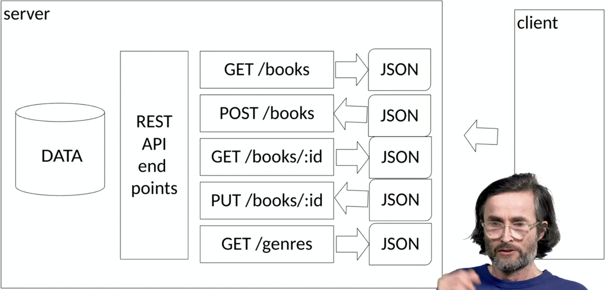

# Accessing and displaying remote data from the internet (REST API)
## Introduction to REST API's
- REST API is a type of web service
- Allows client to interact with web servers using standard HTTP methods and data formats like JSON or XML

### Repesentational State Transfer
- Stateless
    - Doesnt remember anything, knows nothing about previous requests in session
- Client-Server architecture
    - Server presens endpoints, client accesses endpoints
- CRUD-able resources via HTTP methods
- Consistent interface 
- Cacheable

### RESTfu activities: CRUD
- Create (POST)
- Read (GET)
- Update (PUT)
- Delete (DELETE)

### Examples of REST API's
- https://publicapis.io

## Using website and indentifying REST API calls
- Load website
- Open network console
    - Filter by Fetch/XHR
    - Click on name
    - Explore tabs to the right
- Identify REST calls
- Examine some of the returned data

## How to setup and access RESTful API
- Install node js
- Unzip the server code
- cd to bookserver folder
- run npm install
- node server.js
- note at what url server is running
- use the server to in fetch method
- et voila, you have the served json pulled in ypur code
- happy exploring (not really tho, right?) 