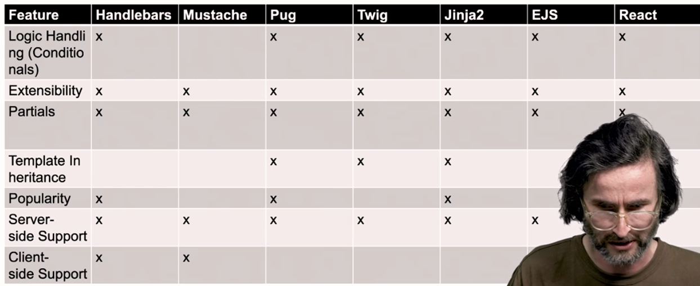

# Real template engines and static website rendering tools
## Examples of current template engines
- Handlebars
    - Similiar to one we developed in week 10
- Mustache
- EJS (embedded javascript)
    - Normally renders on serverside, but can also render client side
- Pug
    - Simpler looking, minimal. Designed to run serverside
- React
    - Similiar to EJS
- Comparison:
    - 
- Week 12, Activity has code examples for Handlebars, Mustache and EJS

## Static site rendering
- Static site rendering workflow:
    - Write content
    - Write template
    - Render to full HTML files
    - Upload and serve

### Example project with Eleventy and Handlebars
- Create file structure, define dependencies in package.json, then run npm install to install all dependencies
- Followed video, but the whole Handlebars/Eleventy project is broken. No wish or time to get it fixed now
- Follow Reading (Activity from week 12 to rebuild it)