# Website lifecycle - Deploying and testing websites
## Basic static website deployment
- 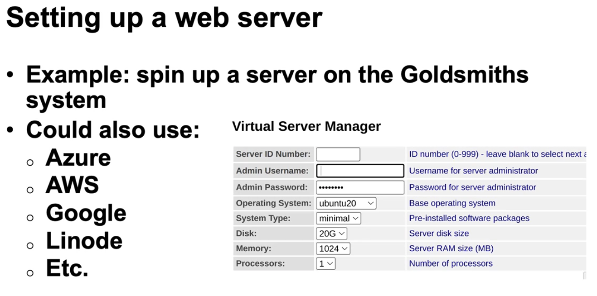
- 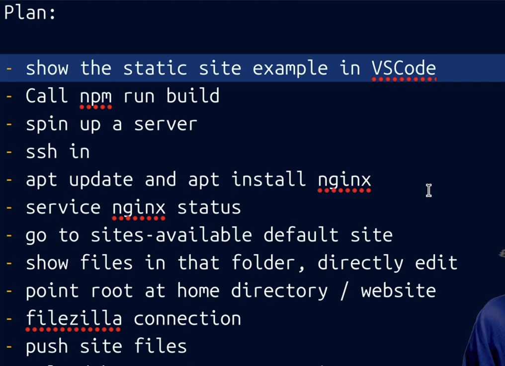
- 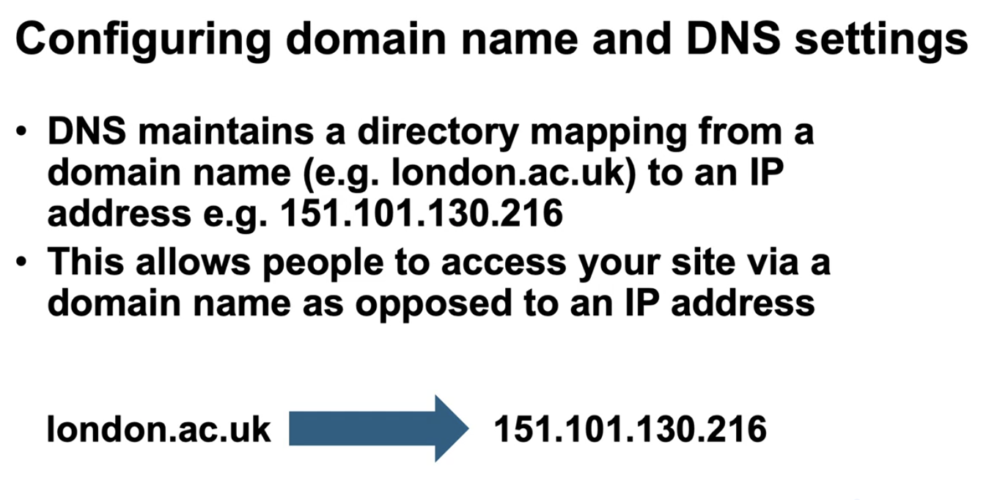
- 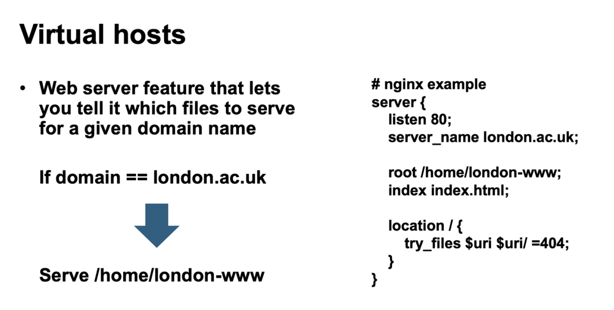
- 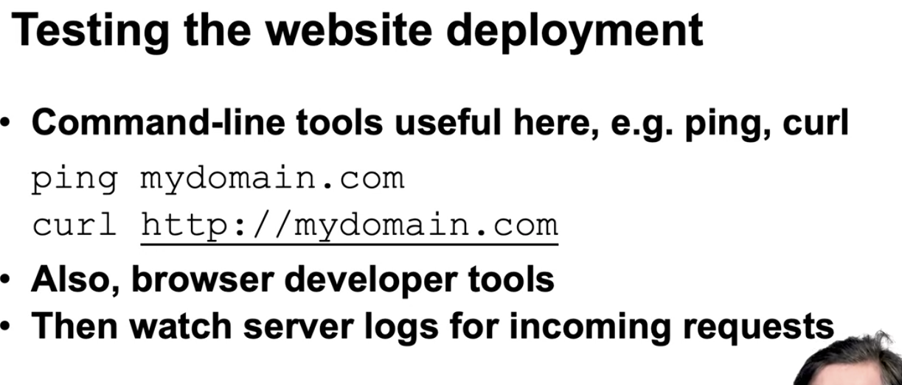
- 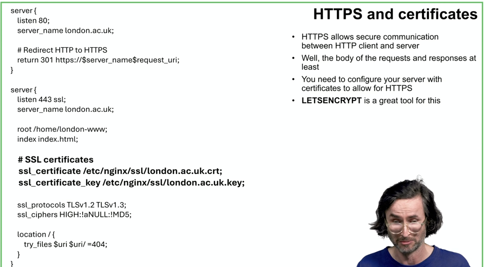
- There is a lab for deployment on week 14

## Non static and scalable website deployment
- 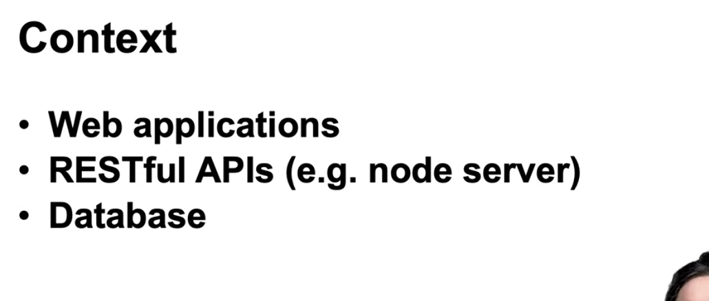
- 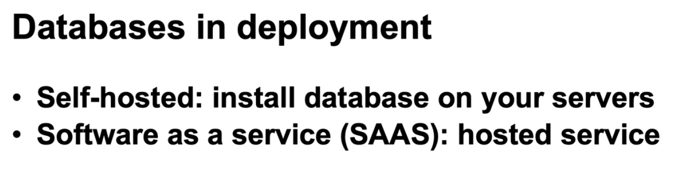
- 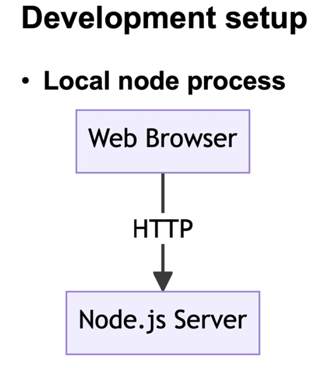
- 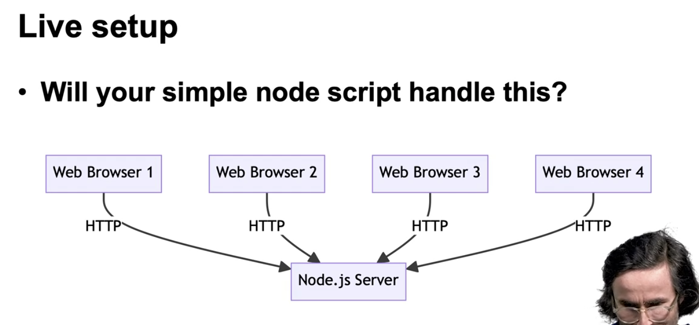
- 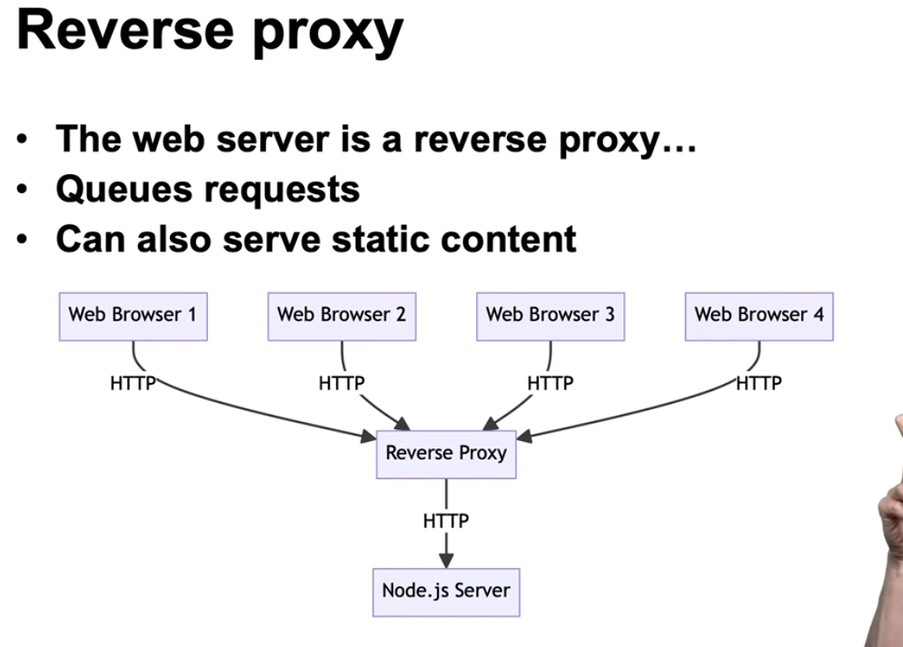
- 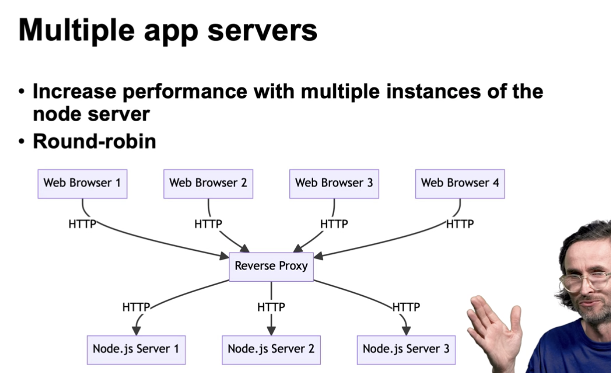
- 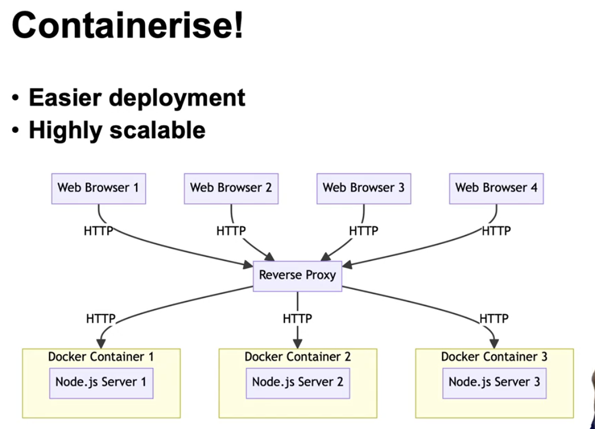
- 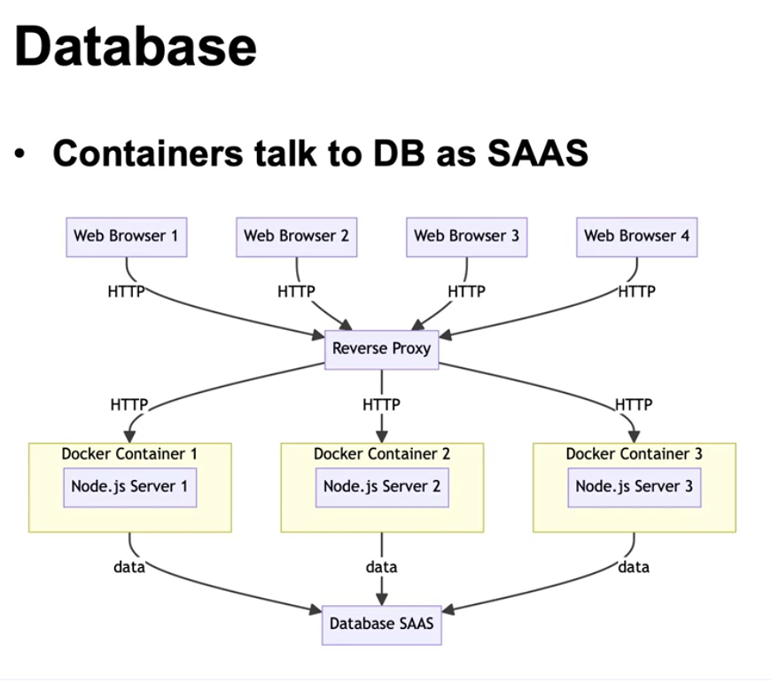
- 
- 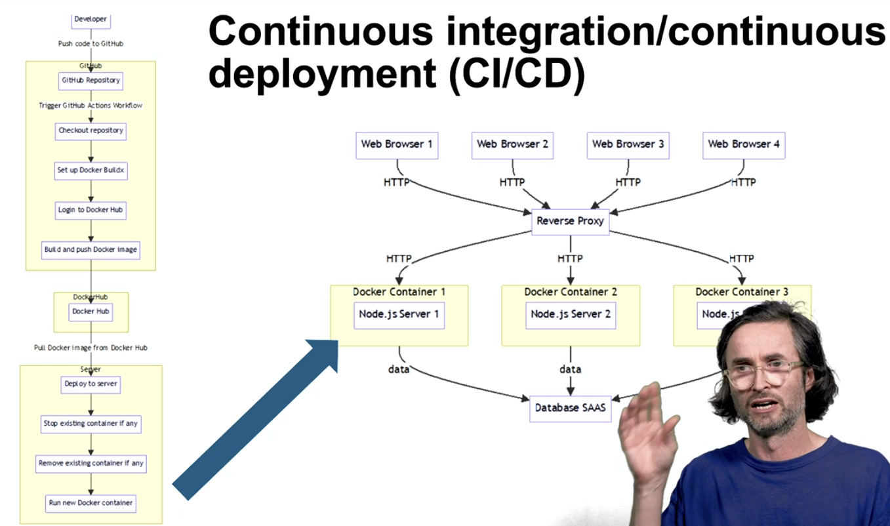
- 
- 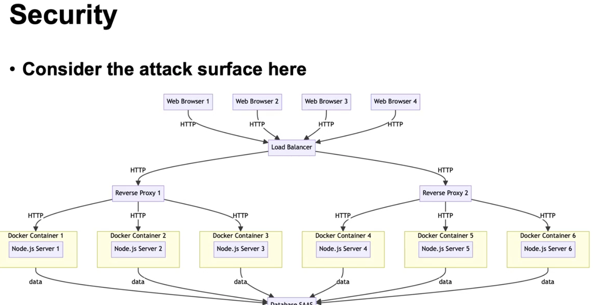

### Activity
-Activity – Non-static and scalable website deployment practical
Get the books server running in node
Upload bookserver.zip to your server.

unzip bookserver.zip
cd bookserver
node server.js

You should see:

Server is running on http://localhost:3000

Now verify you can see the API data directly from the node server by visiting http://localhost:3000/api/books in Chrome, launched from the linux desktop environment.

You should see some raw JSON data in Chrome

Configure nginx to reverse proxy to the node API server
sudo apt install nginx nano
sudo service nginx start
sudo nano /etc/nginx/sites-enabled/default

Insert the reverse proxy config for /api.

# Just before this line: location / {
# put this: 
location /api/ {
proxy_pass http://localhost:3000/;
proxy_http_version 1.1;
proxy_set_header Upgrade $http_upgrade;
proxy_set_header Connection 'upgrade';
proxy_set_header Host $host;
proxy_cache_bypass $http_upgrade;}

Now try hitting http://localhost/api/books in Chrome running in the linux environment. You should see the same raw JSON data. If you see ‘502 Bad Gateway’ it means that nginx was not able to pass the request over to localhost:3000. Most likely the node server is not running.

At this point you should be able to access three different services:

http://localhost accesses the index.html file from your website folder (probably /home/coder/website), via nginx.

http://localhost:3000/api/books accesses the raw books directly from the node server

http://localhost/api/books accesses the raw books from the node server, via the nginx server.

Challenge: upload and operationalise your book client code
Now you can see if you can upload your book client website to the website folder so it can be served on http://localhost. The client website should talk to the API on http://localhost/api/books. Can you make this work? Remember that static files are served from the folder specified in the ‘root’ option in the nginx default config file. So you need to put your book client code in there.

Completion checklist
Get the books server running

Install and configure Nginx

Verify Nginx proxy

Upload and verify book client website