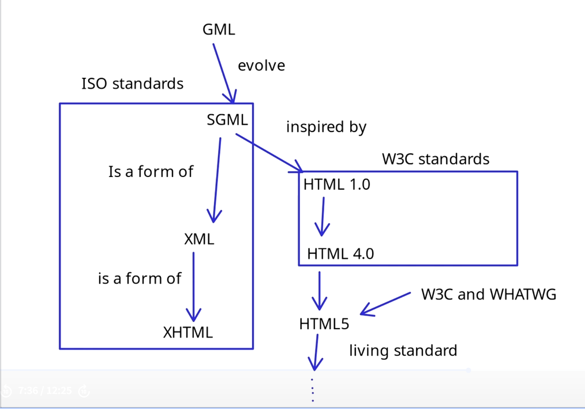

## 2. HTML
### Markup
- Early document markup: RUNOFF (1964)
    - >Runoff is a command used to type out memorable files of English text in manuscript format. Control words scattered in the text provide detailed control over the format if desired.
    - .he for headings
    - .ce for centering
    - .sp2 space 
    - mostly for formatting, but also some semantics.
- Goldfarbs's principles of markup (GML(Generalised Markup Language), 1970):
    - :q.markup::q. - quotes
    - :oi. - ordered list start
    - ::oi. - ordered list end
    - li. - list item
- GML morphed into SGML, adding tags:
    - :li ---> \<li>...\</li>
    - \<title> My Title\</title>
    - SGML became ISO standart in 1986
- HTML family tree:
    - HTMl is SGML-like but
    - XHTML is a form of SGML(XML)
    - HTML5 is a living standard
    
- Types pf tokens in HTML5:
    - DOCTYPE
    - Start tags
    - End tags
    - Attributes
    - Text 
    - Comments \<!-- -->
    - Character references
    - CDATA- Structured data

### Hypertext/Hyperlinks

- >Hypertext is a combination of natural language text with the computers capacity for interactive branching or dynamic display of nonlinear text which cannot be printed conveniently on a conventional page  
-Ted Nelson 1987
- Hyperlink:
    - Reference to data
    - Reader can directly follow, either by clicking, tapping or hovering
    - An anchor tag (\<a href=''>) in HTML that links to another webpage, document or resource
- Hyperlinks in modern web:
    - More than just static links
    - Can be dynamic and interactive
    - Criggering events such as loading content via Ajax using background requests
    - Navigating within a SPA
    - Performing actions like submitting a form
- Best practices for hyperlinks:
    - Use descriptive text
    - Make them accessible to screen readers
    - Test them regularly to ensure they work properly

### Common elements in modern web design
- Headers:
    - Establish the identity of the website and provide easy access to major areas via navigation links
- Navbars:
    - Categoricaly list important links that are essential for site navigation
- Body:
    - Main content of the page
- Footer
    - Secondary navigation area, housing links, copyrights and other less prominent yet important information

### Well formed, valid and semantic HTML
- Structured correctly:
    - Open/close tags
    - Nested elements
    - Attributes in the correct format
- Semantic web is set of different technologies such as OWL, RDF, SPARQL.
- Semantic HTML is a way of adding structure and meaning to the content in your HTML documents
- Common semantic HTML tags:
    - header
    - nav 
    - section
    - article
    - footer
    - figure
