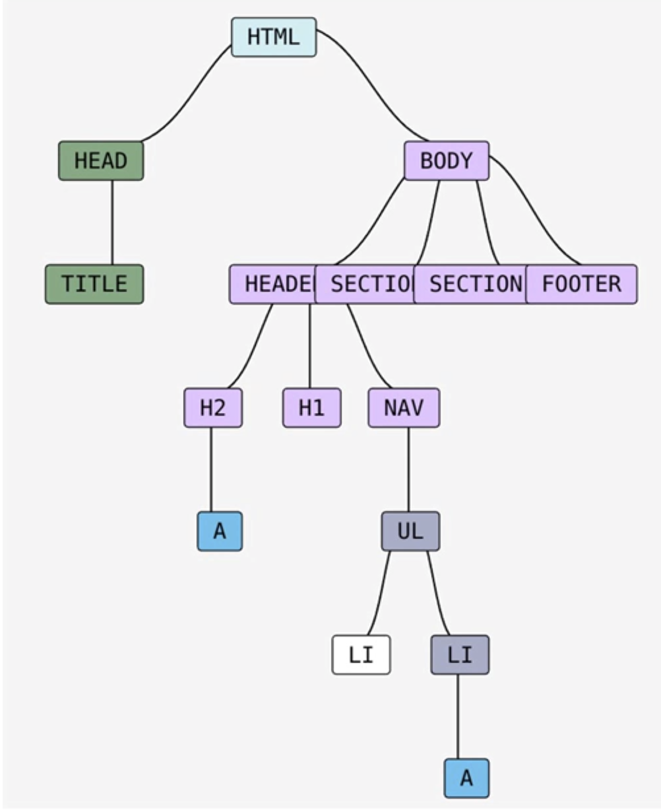
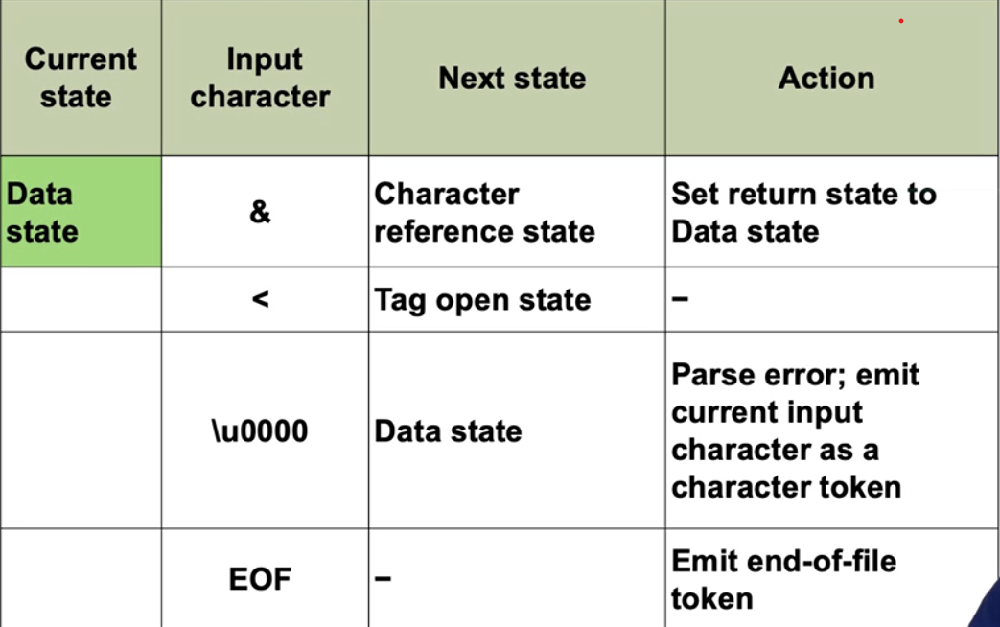

## 3. Data structures and algorithms for web development
    - Describer DOM 
    - Use browser console to interact with DOM
    - Explain HTML parsing process specified in WHATWG 
    - Calculate computational cost of HTML parsing algorithm

### DOM
>"With the DOM, programmers can create and build documents, navigate their structure, and add, modify or delete elements and content."

> "DOM defines a platform-neutral model for events, aborting activites, and node trees"

> "A tree is finite hierarchical tree structure"

- The World Wide Web could be viewed as a forest of DOM trees. (Or as a graph)

### Interacting with DOM via Developer Tools in browser

- F12 to open Dev Tools (Chrome based browsers at least)
- To get to DOM properties, right-hand side wheres Styles abd Layout are, click '>>'

### DOM can change dynamically
- DHTML: HTML can change after being loaded (without a full reload), usually by javascript and AJAX (REACT is basically DHTML)
- Dynamic WEB pages: HTML is generated on the fly by the server
- SPA:DHTML driven by data from server

### Basic HTML Parsing: The tag stack
- Basically parses HTML, when sees opening tag, pushes it to stack, when sees corresponding closing tag, pops that HTML element off the stack.
- From tag stack, the DOM is being built using the hierarchical structure from tag stack

### State transition tables and HTML parsing
- State transition table:

### The WHATWG HTML parsing algorithm
1. Input stream handling
2. Tokenisation
3. Tree construction
4. Insertion nodes
5. Handling foreign content
6. Error handling
7. Finalising the tree
8. Speculative parsing

### Error handling strategies in parsing

>"Validity is on of the quality criteria of web page, but there are many others. In other words, a vaid web page is not necessarily a good web page,, but an invalid web page has little chance of being a great we page."

- Some reasons:
    - Graceful degradation
    - HTML changes over time
    - HTML is written by humans
- Example conditions:
    - Bad tags: Bogus comment state->Parse error.

- Quiet useless video to be fair....
- And useless week as well.
