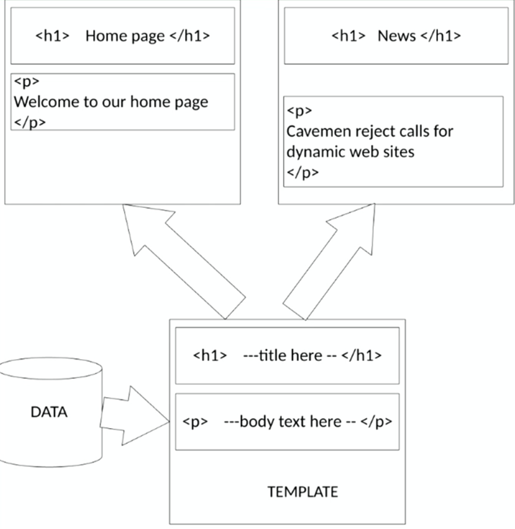
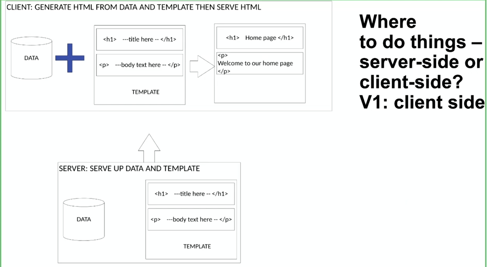
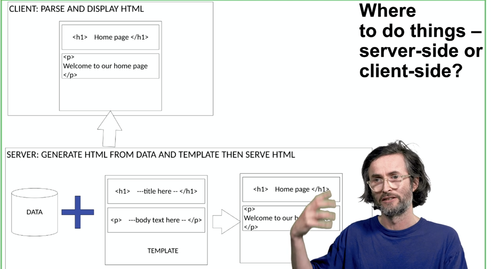
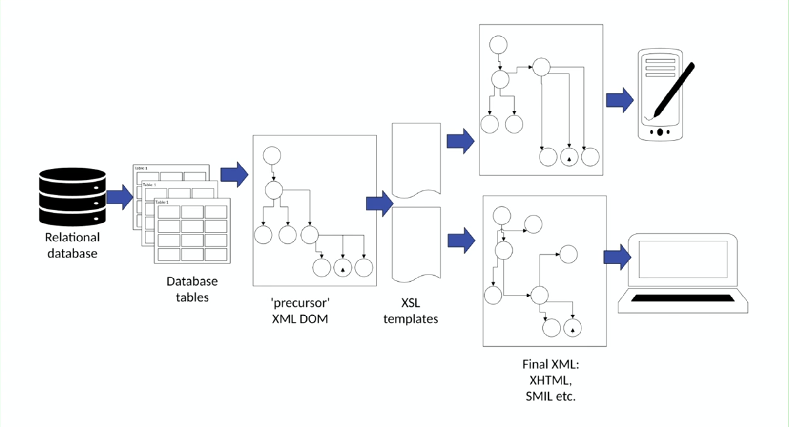

# Accessing and using local data sources
- Problems with static sites
- Generating HTML on the fly
- Data + JS -> HTML
- Server-side vs Client-side

## From static to dynamic sites

### Problems with static sites:
- Difficult to:
    - Manage content updates
    - Scale the amount of content
    - Update content frequqntly/automatically
    - Manage user input

### Generating HTML on the fly:


### Worked example: JS, data, DOM
- Create some variables:
    ```
    ...
    <head>
        <title id="head_title"></title>
    </head>
    <body>
        <nav>
            <ul>
                <li>
                    <a onclick = "updatePage(title1, h1_title1, content1)" href="#">Home</a>
                </li>
                <li>
                    <a onclick = "updatePage(title2, h1_title2, content2) href="#">News</a>
                </li>
            </ul>
        </nav>
        <h1 id="h1_title"></h1>
        <p id="content"></p>
    </body>
    ```
- Insert variables into the HTML depending on the page variable:
    ```
    ...
    <script>
        let head_title_1 = "My Homepage"
        let h1_title_1 = "Some title"
        let content_1 = "Very interesting content"
        
        let head_title_2 = "Some other page on site"
        let h1_title_2 = "Other title"
        let content_2 = "Even more interesting interesting content"

        function updatePage(title,h1_title content){
            document.getElementById("head_title").textContent = head_title
            document.getElementById("h1_title").textContent = h1_title
            document.getElementById("content").textContent = content
        }
    </script>
    ```

### Client-side 
- Simplicity advantage


### Server-side
- Speed advantage


## Data Formats
- Options:
    - XML
        - Quiet verbose, lots of tags to send over network
        - Lack of native support for common data structures such as arrays
        - Not very human-readable
        - Example: 
        ```
        <bookstore>
            <book>
                <title>Bible</title>
                <author>God</author>
                <price>100</price>
                <genre>Fiction</genre>
            </book>
            <book>
                <title>Alice in wonderland</title>
                <author>Unavailable</author>
                <price>25</price>
                <genre>Fiction</genre>
            </book>
        </bookstore>
        ```
    - YAML
    - CSV 
    - JSON
        - Hierarchical key value pair system
        - Lightweight data interchange format
        - Easy fpr humans to read/write
        - Easy for machines to parse/generate
        - Text-based
        - Language independant
        - Keys are always strings
        - Values can be:
            - Strings ""
            - Numbers
            - Arrays []
            - Objects {}
            - Boolean values
            - null
        - Example:

        ```
        {
        "bookstore": [
            {
                "title":"Bible",
                "author":"God",
                "price":100,
                "genre":"fiction"
                "available":False
            },
            {
                "title":"Alice in wonderland",
                ...
            }
        ]
        }
        ```
    - others
### How things were done 25 years ago: 


## Reading JSON using JS

- !!WARNING!!: Gnarly JS syntax
    - Event listeners
    - Promises
    - Exception handling
    - Anonymous functions
    - For Each loops
- Accessing JSON from HTML:
    ```
    Call loadJSON when the document has completely loaded DOMContentLoaded event to trigger as soon as HTML loaded:

    document.addEventListener(
        "DOMContentLoaded",
        () => {
            loadJSON();
        });
    
    function loadJSON(){
        fetch("data.JSON).then(response => response.json()).then(jsonData => {
            console.log(jsonData);
        })
        .catch(errora => {
            console.log("Caught Error")
            console.log(error)
        })
    }

## Converting JSON into HTML
- Now lets put it into HTML
   ```
    function loadJSON(){
        ///Use  async promise syntax
        fetch("data.json")
        .then(response => response.json()) ///Converts response to JSON object
        .then(jsonData => {
            parseJSON(jsonData); /// Parses the JSON file with another function
        })
        /// If exception happens in the bove code, log out the error
        .catch(error => {
            console.log("Caught Error")
            console.log(error)
        })
    }
    
    function parseJSON(jsonData){
        let content_div = document.getElementById("content")

        jsonData.books.forEach(book => {
            /// Create elements
            let book_div = document.createElement("div")
            let h2_div = document.createElement("h2")
            let p_tag = document.createElement("p")

            ///put book title in h2 element, and author in p tag
            h2_div.textContent = book.title
            p_tag.textContent = book.author

            /// Append book_div to content
            content_div.appendChild(book_div);
            /// And h2_div and p_tag to book_div
            book_div.appendChild(h2_div)
            book_div.appendChild(p_tag)
        })
    }
    ```


## Working with JSON files, seaarching and looping

### Filter: subset of the array based on a filter
- Filter by property example:
    - nature_books will be array containing only the books with corresponding genre
    - === also checks if it is same type AND value, exactly 
    - true == 1 but NOT true === 1, "1" == 1, but NOT "1" === 1
    ```
    const nature_books = books.filter(book => book.genre === "Nature")
    ```

### Map: reformat data in the array to a new array
- Map to reformat the data
    - Iterate over books array creating a new array made of simpler title + author objects
```
const titlesAndAuthors = books.map(book => (
    {
        title:book.title,
        author:book.author
    }
))
```


### Reduce: compute over the array
- Reduce to compute over the array:
    - Creates a variable called total, starts total at 0, iterates the books array and adds book.price to the total
```
const totalPrice = books.reduce((total, book) => total + book.price, 0);
```